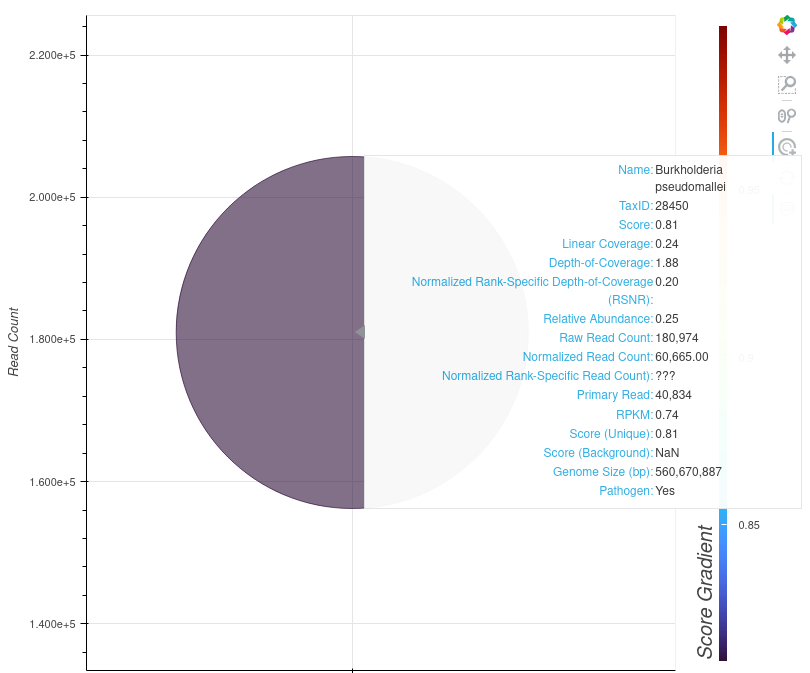

PanGIA\_GUI\_README
================
Gus Thomas
10/6/2021

# **PanGIA GUI Manual:**


## **QUICK INSTALLATION**
* Open a terminal and navigate to the directory location you'd like to download this code.
* Download the pangia gui and database files.
```
git clone https://github.com/mriglobal/PanGIA_GUI.git && mkdir PanGIA_GUI/PanGIA/database && cd PanGIA_GUI/PanGIA/database
wget http://pangia1.0.s3.amazonaws.com/pangia_database.tar.gz && tar -xvf pangia_database.tar.gz && rm pangia_database.tar.gz
cd ../../
```
* Install Docker. See docker instructions for your OS (https://docs.docker.com/engine/install/)
* Build the docker images for PanGIA. You should currently be in the "PanGIA_GUI" main folder.
```
DOCKER_BUILDKIT=1 docker-compose up --build
```
* Go to localhost:5000 in your web browser.
* Create an admin user with default setup checked
* Click on Settings in the left navigation. Then go to Projects in the top tabs.
* On this page create your first Project to add fastq/fasta files to upload to. Name and slug are required.
* Navigate to the project you created in the left nav, upload a fastq or fasta file and hit the Run PanGIA button.
* To shut down the service press ctr + C in the terminal
* To restart the service where you left off, open a terminal, cd to the PanGIA_GUI directory, type `docker compose up`

## **Table of Contents**

### 1. [Introduction](#section-1-introduction)

### 2. [Initial Download](#section-2-initial-download)

      **2.1**: [**PanGIA & PanGIA
GUI**](#section-21-pangia-and-pangia-gui)  
          *2.1.1*: [*Downloading from the Command
Line*](#section-211-downloading-from-the-command-line)  
          *2.1.2*: [*Downloading
Manually*](#section-212-downloading-manually)  
      **2.2**: [**Reference
Databases**](#section-22-reference-databases)

### 3. [Preparing the Compute Environment](#section-3-preparing-the-compute-environment)

      **3.1**: [**Preparing a Non-Dockerized
Environment**](#section-31-preparing-a-non-dockerized-environment)  
      **3.2**: [**Preparing a Dockerized
Environment**](#section-32-preparing-a-dockerized-environment)

### 4. [Using the GUI](#section-4-using-the-gui)

      **4.1**: [**Accessing the GUI**](#section-41-accessing-the-gui)  
          *4.1.1*: [*Non-Dockerized
Case*](#section-411-non-dockerized-case)  
          *4.1.2*: [*Dockerized*](#section-412-dockerized-case)  
      **4.2**: [**GUI Navigation**](#section-42-gui-navigation)  
          *4.2.1*: [*Dashboard*](#section-421-dashboard)  
          *4.2.2*: [*Users*](#section-422-users)  
          *4.2.3*: [*Settings*](#section-423-settings)  
              *4.2.3.1*: [*General
Settings*](#section-4231-general-settings)  
              *4.2.3.2*: [*Project
Settings*](#section-4232-project-settings)  
              *4.2.3.3*: [*File Template
Settings*](#section-4233-file-template-settings)  
              *4.2.3.4*: [*Meta Type
Settings*](#section-4234-meta-type-settings)  
          *4.2.4*: [*Projects*](#section-424-projects)  
              *4.2.4.1*: [*Running PanGIA from the Projects
Tab*](#section-4241-running-pangia-from-the-projects-tab)  
              *4.2.4.2*: [*Exploring the Projects
Tab*](#section-4242-exploring-the-projects-tab)  
          *4.2.5*: [*PanGIA & PanGIA
Results*](#section-425-pangia-pangia-results)  
              *4.2.5.1*: [*Results Page*](#section-4251-results-page)  
          *4.2.6*: [*Real-Time PanGIA*](#section-426-real-time-pangia)  
      **4.3**: [**Examples of Usage**](#section-43-examples-of-usage)  
          *4.3.1*: [*Baseline Example*](#section-431-baseline-example)

### 5. [Planned Visualizer Features](#section-5-planned-visualizer-features)

## *Section 1)*: **Introduction**

This report contains instructions for the installation and use of the
graphical interface designed for PanGIA. PanGIA is standalone and may be
run independently from the command line. However, this forces the
responsibilities of manual configuration and record keeping onto the
user.

This GUI companion to PanGIA makes the pathway to discovery more
efficient and exciting by streamlining the run specification/execution
process, providing a robust job queue, enabling real-time PanGIA
processing, and constructing an intuitive, informative, dynamic
visualization tool for result analysis. The GUI is composed of six
parent pages: Dashboard, Users, Settings, Projects, PanGIA, and Real
Time. If you have already completed PanGIA setup and are using this
document as a GUI reference, please consult [**Section
4.2**](#section-42-gui-navigation) onward.

## *Section 2)*: **Initial Download**

This section details the process of downloading PanGIA, the GUI, and
curated reference databases necessary to run PanGIA.

### **Section 2.1)**: **PanGIA and PanGIA GUI**

#### *Section 2.1.1)*: *Downloading from the Command Line*

1.  Navigate to preferred local path.

2.  Use a `git clone` command on
    `git@gitlab.mriglobal.org:gus-mri/pangia_flask_gui_docker.git` -
    navigate into the cloned repository to verify.

#### *Section 2.1.2)*: *Downloading Manually*

1.  Go to <http://gitlab.mriglobal.org/gus-mri/pangia_flask_gui_docker>
    and download the repo. Extract files to your preferred location.
    Navigate into the extracted repository to verify.

### **Section 2.2)**: **Reference Databases**

**Talk about ftp download here. Check with the team about whether the
new database has been indexed/tested and is accessible.**

## *Section 3)*: **Preparing the Compute Environment**

PanGIA requires a specific compute environment to satisfy its run-time
dependencies. We consider two cases: an environment constructed locally
within a specific Linux distribution, and a PanGIA-friendly Docker
environment independent of the host machine.

### **Section 3.1)**: **Preparing a Non-Dockerized Environment**

1.  Install the latest distribution of Anaconda or miniconda. Ensure you
    are running a compatible Linux distribution (Ubuntu/Pop-OS
    16.04-20.04).

2.  In a terminal, navigate to the PanGIA GUI directory (named
    `pangia_flask_gui_docker` by default) created in [**Section
    2.1**](#section-21-pangia-and-pangia-gui) and use command:
    `conda env create –f  gui.yml`. This command acts on the .yml file
    within the GUI root directory to construct a `conda` environment. By
    default, the name of the environment will be `gui`, but you may
    replace this with any preferred name by changing the prefix of the
    .yml file prior to creating the environment.

3.  Open a command line window and navigate to the GUI directory. Use
    command: `conda activate XXX`, where `XXX` is the name of the
    environment. Use the following series of commands to finish initial
    database and environment setup:

-   `export FLASK_APP=pangia_gui.py`
-   `flask db init`
-   `flask db migrate –m`
-   `flask db upgrade`

Ignore any errors that pop up! These commands are used to initialize the
flask database that the GUI relies on. In the event that you reset your
GUI (see below), having entered these commands will mitigate any further
action you need to take.

Whenever accessing the GUI, **begin by opening three separate command
line terminals**, and navigate all three into the
`/pangia_flask_gui_docker/gui` directory. In each of the three windows,
execute the `conda activate XXX` command, where `XXX` is the name of the
`conda` environment specified above in [**Section
3.1**](#section-31-preparing-a-non-dockerized-environment) (`gui` by
default). Note that each instance will be responsible for running one of
three services comprising the GUI. See [**Section
4.1**](#section-41-accessing-the-gui) for more information. **The GUI
can be completely reset by navigating to
<http://localhost:5000/auth/reset_site> - this is recommended only in
cases where the job queue is stuck. Bugfix pending.**

### **Section 3.2)**: **Preparing a Dockerized Environment**

1.  Download Docker and Docker Compose. Docker Compose must be installed
    separately, if you are using any Linux OS. Please follow Docker’s
    official instructions at <https://docs.docker.com/get-docker/> to
    install Docker - for Linux machines, an additional step is required
    to grant root access to non-root users for Docker commands. Without
    taking this step, you will need to prepend every Docker command with
    `sudo`. Please see
    <https://docs.docker.com/engine/install/linux-postinstall/> for
    instructions. If you are using a Linux OS and would like access to a
    Docker GUI (in lieu of the Linux-incompatible Docker Desktop), we
    recommend the lazydocker package. See
    <https://github.com/jesseduffield/lazydocker> for details.

2.  On the command line, navigate to `/pangia_flask_gui_docker`.

3.  In the sub-directory `/pangia_flask_gui_docker/PanGIA`, add folders
    `uploads` and `database` if they aren’t there already. Transfer any
    databases you previously downloaded in [**Section
    2.2**](#section-22-reference-databases) into the `database` folder.
    The GUI will place your Projects (which will contain relevant
    user-uploaded fastq files) into the `uploads` folder. See [**Section
    4.2.4**](#section-424-projects) for more details about Projects.

4.  On the command line at `/pangia_flask_gui_docker` use command:
    `DOCKER_BUILDKIT=1 docker compose up --build`. Please wait while the
    required Docker images are pulled from Docker Hub, and the `conda`
    environments are constructed. This may take a few minutes, but
    subsequently launching the service will take seconds. [**Section
    4.1.2**](#section-412-dockerized-case) describes how to launch the
    service in both regular-mode and detached-mode after initial setup.

5.  **Navigate to <http://localhost:5000/auth/reset_site> for first-time
    GUI access**. After first-time access, navigate to `localhost:5000`.
    If you bring down the containers (via computer shutdown or a
    `docker-compose down` command), use `docker-compose up` to bring the
    built service back up.

## *Section 4)*: **Using the GUI**

Running PanGIA through the GUI assumes that three independent services –
the worker, scheduler, and Flask server – are already operational.
[**Section 4.1**](#section-41-accessing-the-gui) covers the process of
bringing each service online if you are not using Docker. We will also
describe the Dockerized case, in which much of the legwork is handled
for you [**Section
3.2**](#section-32-preparing-a-dockerized-environment) by Docker
Compose.

A complete tour of the GUI can be found in [**Section
4.2**](#section-42-gui-navigation). We describe two examples of PanGIA
runs in [**Section 4.3**](#section-43-examples-of-usage); a run using
standard analysis in [**Section 4.3.1**](#section-431-baseline-example),
and a Real-Time run in [**Section
4.3.2**](#section-432-real-time-example).

### **Section 4.1)**: **Accessing the GUI**

#### *Section 4.1.1)*: *Non-Dockerized Case*

1.  Following instructions listed at the the end of [**Section
    3.1**](#section-31-preparing-a-non-dockerized-environment), prepare
    three command-line terminals; each must be navigated to
    `/pangia_flask_gui_docker` and an activated `conda` environment.

2.  In the first window use command: `redis-server`. The window should
    look something like this:

 3. In the second window use
command: `rq worker pangia-tasks`. The window should look something like
this:


4.  In the third window use command: `flask run`. The window should look
    something like this:


5.  Click on the link displayed at the bottom of the `flask run`
    terminal. Alternatively, in a web browser, navigate to
    localhost:5000 for GUI access.

#### *Section 4.1.2)*: *Dockerized Case*

1.  In any command line window, navigate to the
    `/pangia_flask_gui_docker` directory.

2.  Use command: `docker-compose up`. **If you would like to be able to
    close the terminal window and allow the Docker service to continue
    running, instead use command: `docker-compose up --detach`. Our
    container will restart automatically, unless it is explicitly
    stopped with the command `docker-compose down`.**

3.  Click on the link displayed at the bottom of the terminal.
    Alternatively, in a web browser, navigate to localhost:5000 for GUI
    access.

### **Section 4.2)**: **GUI Navigation**

#### *Section 4.2.1)*: *Dashboard*

After logging in, users are directed to this page. It lists the history
of both the most recent PanGIA runs and ongoing runs. Links to results
and/or the ongoing job status page is provided under each listing. At
the very bottom of the page, users may click a link directing to the
PanGIA section of the GUI, described in more detail below.


### **Section 4.2.2)**: **Users**

Interface for adding users to the GUI’s persisted database. Current
users are listed with name, username, email, date of last login, and
role (Admin, User, etc.).


### **Section 4.2.3)**: **Settings**

Multi-tabbed interface for specification of general settings, PanGIA
preprocessing/run parameters, project categories, file templates, and
meta-types. Specifics for each tab and sub-tab are listed below.

##### *Section 4.2.3.1)*: General Settings

These settings are dedicated to tailoring PanGIA runs to the user’s
default needs. Most general settings may be adjusted on-the-fly, while
preparing any PanGIA run. However, preparing defaults here will save
time. The general settings are subdivided into three categories:

1.  **Application Settings**: User specifies PanGIA directory path and
    PanGIA database/uploads path. If you are running the GUI without
    Docker, you may need to adjust the path to reflect wherever you put
    the `/pangia_flask_gui_docker/PanGIA` folder. **If you are using
    Docker, this pathway will already reference the PanGIA directory
    mounted to the service - you should not need to make any changes**.
    Users may also adjust thread-count made available for PanGIA. An
    even number is recommended. Default is two threads.


2.  **Preprocessing**: Options to alter/filter reads prior to PanGIA
    analysis. May trim reads for quality level, adjust the average
    quality, minimum read length, and “N” base cutoff values, apply a
    low complexity filter, exclude PolyA tails, or indicate a custom
    number of base pairs to cut from 5’ or 3’ ends of reads. The user
    may opt to skip preprocessing (equivalent to running PanGIA on the
    command line with the `-da` tag) by setting all values to zero and
    unchecking all boxes.


3.  **Run Parameters**: Options determining read scoring, and additional
    forms of analysis (TMARK, Decision Tree, etc.). You may specify
    values for seed length, and assign minimal values for score, aligned
    score, read count, read RSNB, linear length, percent genome
    coverage, and depth/RS depth. Please note that the current version
    of the GUI Visualizer will not take values entered here into account
    on launch; all Slider widgets are set to launch with a default value
    of 0. The scoring method for the PanGIA run may be selected from a
    drop-down menu (Standalone/Background/Combined), and a series of
    check boxes determine if additional analyses will be included in the
    run.


##### *Section 4.2.3.2)*: *Project Settings*

*Projects* are used to consolidate and organize related .fastq files and
PanGIA runs. Existing *Projects* may be archived or deleted. *Projects*
are instantiated with a name, description, and slug. They may be
constructed as children of an existing parent *Project*. When providing
a name and slug, use only alphanumeric and ‘\_’ characters. **Please use
the same value for both ‘name’ and ‘slug’ - bugfix pending.**


##### *Section 4.2.3.3)*: *File Template Settings*

User may specify PanGIA input file types other than .fastq on this tab.
File Templates require a name, description, and file extension. When
creating a new File Template, the user must decide which Meta-Types will
be available for runs using that File Template. A default for .fastq
files is included.


##### *Section 4.2.3.4)*: *Meta-Type Settings*

User may impose additional rules regarding meta-data, grouping it
together and limiting input variance. Default Meta-Types include names
of spiked-in organisms and spike-concentration, sequencing protocol, and
the sampling date. User may specify whether data was a control sample.
New Meta-Types require a name, description, and value (string, integer,
Boolean, date, etc.), and may be designated as ‘required’ if desired.


#### **Section 4.2.4)**: **Projects**

Provides the name of each *Project* constructed in the Settings.
Clicking on the name of a *Project* yields a list of all the files that
have been uploaded to it. The list is grouped by *File Template*. Files
may be ordered by ascending/descending or date/name. Each *File
Template* header has a large blue button labeled ‘Add New File’ - this
directs the user to the upload interface. Files uploaded through the GUI
are copied into a new directory named after the *Project* in the
`/uploads` directory.


##### *Section 4.2.4.1)*: *Running PanGIA from the Projects Tab*

To start a job from the *Project* menu, use the ‘Run PanGIA’ button on
any file uploaded to the *Project*. Each run requires a name and
description. Drop-down menus specify which paired files are to be used.
The first menu option defaults to whatever file the Run Information page
was accessed from. All General settings may be adjusted here: the
interface is identical to that appearing in [**Section
4.2.3.1**](#section-4231-general-settings).


##### *Section 4.2.4.2)*: Exploring the Projects Tab

Files listed within a *Project* have three interactive links. The ‘View
Meta Data’ and ‘View Results’ links direct the user to a new page, with
two tabs. The first tab is named ‘X Information’, where ‘X’ is the *File
Template*; the second is named *Results*.

1.  The ‘X Information’ tab (‘Fastq Information’ in the image below)
    specifies the filename, upload date, filepath, and description.


2.  The ‘Results’ tab lists all PanGIA runs that the file has been part
    of. Details include run name/date, description, parent *Project*,
    user, and filenames.


3.  Notice above: on the right side, runs have a link labeled ‘View
    Results’. Following this link directs the user to the PanGIA
    *Results* section of the GUI, described below in [**Section
    4.2.5**](#section-425-pangia-pangia-results).

#### **Section 4.2.5)**: **PanGIA & PanGIA Results**

Lists all queued and completed jobs, regardless of Project. Each
completed job contains the same information found in the ‘Results’ tab
accessible through the *Projects* section of the GUI; each job also has
the same ‘View Results’ link. Both are described above in [**Section
4.2.4**](#section-424-projects).

##### *Section 4.2.5.1)*: *Results Page*

The *Results* page provides run name and description, and features an
interactive window to browse rows of the .tsv file output of the PanGIA
run. This page also links to the GUI Visualizer, which will graphically
display that output. An in-depth PanGIA run log is provided at the
bottom – the printout there is similar to what can be found in in the
worker printout during the run. An example *Results* page appears below.


#### **Section 4.2.6)**: **Real-Time PanGIA**

User specifies a job name, description, and associated *Project*, as
usual. Instead of paired files, the user must provide the path to a
directory that Real-Time PanGIA is listening for. This directory should
be the dumping point for ongoing nanopore sequencing, processed by
Guppy. Notably, once Real-Time PanGIA is initiated, the user must
manually terminate the job as desired. Completed Real-Time jobs persist
PanGIA results from the last job iteration.


**IMPORTANT**: **If you are using the Dockerized version of the GUI, the
fastq directory path must always begin with `/gui_flask`**. This is
because `/gui_flask` is the name of the Docker “volume” - it is the
version of the repository on the local file system
(`/pangia_flask_gui_docker` by default) that the Docker service has
access to. We have included a folder for Real-Time output that you can
use: `/PanGIA/real_time`. We suggest that you set Guppy output to dump
into this folder, and also specify it here. In that case, the full fastq
directory path would be: **`/gui_flask/PanGIA/real_time`**.

### **Section 4.3)**: **Examples of Usage**

#### **Section 4.3.1)**: **Baseline Example**

The following walkthrough describes a typical PanGIA run with default
settings. For this example, assume the Project ‘SOP\_Runs’ has already
been established. For the purposes of this tutorial, assume that two
.fastq files – named ‘BMal\_100000\_rep1\_R1’ and
‘BMal\_100000\_rep1\_R2’ – have already been uploaded to the Project.
The file page for such a scenario appears below.

Clicking on the Run PanGIA buttons associated with either .fastq file
directs to the Run PanGIA page. As discussed in [**Section
4.2.4.1**](#section-4241-general-settings), this page is split into Run
Information and General settings. Pressing the button associated with
‘BMal\_100000\_rep1\_R1’ directs to the Run Information page shown
below.


This run has been given a name and description, and a selection for the
‘Paired Fastq’ has been made – in this case, ‘BMal\_100000\_rep1\_R2’.
None of the General settings on the Run PanGIA page need to be adjusted,
as this is a default PanGIA run – so this job is ready to be executed by
clicking on the Run PanGIA button at the bottom of the page!

The PanGIA job is now running, which may be verified at the Dashboard or
the Running Job page. If additional PanGIA runs were queued behind
‘BMAL100k’, they would be listed in the Dashboard.


The Running Job page is a run log, and should look similar to the rq
worker printout, as seen below:


After the job is finished, the Running Job page turns into a Results
page. Job completion will be reflected in the PanGIA page of the GUI:


Following the ‘View Results’ link takes us to the Results page, which
should look something like this:


Clicking the PanGIA Visualization button opens the Visualizer in a
separate window. More detail concerning planned features are described
in [**Section 5**](#section-5-planned-visualizer-features), but the
scatterplot for the static PanGIA run as described in this section
should appear similar to the one depicted here:


##### *Section 4.3.1.1)*: *Baseline Example Visualizer Usage and Analysis*

This section discusses current features of the Visualizer and uses the
PanGIA run from [**Section 4.3.1**](#section-431-baseline-example) to
describe how the Visualizer is used to interpret PanGIA results.
Presently, the Visualizer displays hits for taxa between the genus and
strain level, and includes a scatterplot and datatable. On the
scatterplot, each dot on the plot corresponds to one such taxa and are
listed on the x-axis.

1.  The scatterplot y-axis indicates ‘Raw Read Count’ of each hit. This
    axis is dynamically scaled based on maximum/minimum values present
    in the sample. In this example, the y-axis covers a very large range
    of values – between an effective measurement of zero reads and
    one-million. While this would be too large a scale for comparison of
    read count between two strain-level hits, it is a suitable scale in
    this example, where genus *Burkholderia* is compared against species
    *Burkholderia mallei* and a strain *Burkholderia pseudomallei*. In
    the image above, the center of the point representing genus
    *Burkholderia* intersects the y-axis (read count) somewhere between
    fifty-thousand and five-hundred thousand reads – followed in order
    of magnitude by species and strain.

2.  The scatterplot color-bar ‘Score-Gradient’ axis on the right
    indicates hit performance on the selected ‘Score’ metric – either
    ‘Standalone’, ‘Background’, or ‘Combined’. The color-bar is also
    dynamically scaled; in the above example, strain *Burkholderia
    pseudomallei* scored lowest among the three hits as indicated by its
    purplish hue, placing it near the bottom of the color-bar. However,
    the minimum value for the color-bar is approximately 80%. This
    result suggests that PanGIA’s confidence in correctly identifying
    this strain is somewhat lower than it’s confidence in correctly
    identifying the species or genus that the strain belongs to, but it
    still quite high. Dynamically scaled axes make comparison between
    close-scoring hits easier, given the landscape of hits are
    restricted to a limited range.

3.  The associated data table for this PanGIA run contains three
    observations – corresponding to the three data points seen in the
    above scatterplot. A condensed summary of the information in a
    single row of this table appears as a tool-tip when the mouse is
    hovered over the center of a dot in the scatterplot.


5.  The tool-tip presents numerical results from a given row of the data
    table. In the below image, *Burkholderia pseudomallei* is shown.



## *Section 5)*: **Planned Visualizer Features**

The PanGIA GUI Visualizer is not complete. A depth-scale-down chart for
an overview of genome coverage is still in development. We aim to allow
the user to customize the dotplot and dynamically adjust the y-axis. We
plan to implement a redrawing of the scatterplot each time the user
makes an adjustment to any of the filtering tools, such that the taxa
listed on the x-axis are removed entirely if one of their values is
filtered out.
